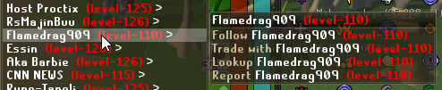

# Improved Context Menu

Improves the context (right click) menu by adding scrolling and other functionality.

## Current features

* (Toggleable) Context menu scrolling, either with mouse wheel or by clicking the `^ ^ ^` / `v v v` menu entries

* (Toggleable) Condensed player options

## Planned features

Check out the Github issues: https://github.com/Thource/improved-context-menu/issues
